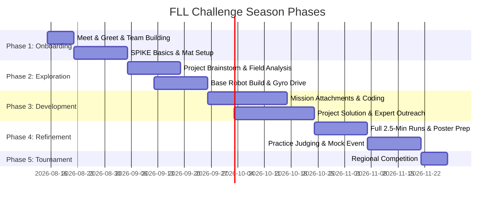

# 🗓️ FLL Challenge Season Roadmap & Timeline

A typical FLL season runs over **12 to 16 weeks** leading up to a Regional Qualifier Tournament.

---

## 🎯 Phase Overview

---

## 📝 Week-by-Week Milestones

### Phase 1: Onboarding & Fundamentals (Weeks 1–3)
- **Week 1 (Meeting 1)**: Meet & Greet (Parents & Students), Team Icebreakers, Core Values introduction, kit unboxing.
- **Week 2**: SPIKE Prime Hub & Motor introduction, build basic driving base (e.g., Advanced Driving Base model), program basic straight drive & turns using Gyro.
- **Week 3**: Sensor exploration (Color sensor for line following/stopping, Distance sensor for wall alignment, Force sensor). Mission field exploration.

### Phase 2: Research & Strategy (Weeks 4–6)
- **Week 4**: Innovation Project topic brainstorming based on season theme. Mission field analysis—evaluate point values, distances, and complexity.
- **Week 5**: Innovation Project problem definition. Choose target missions for Launch 1 & Launch 2. Build first custom robot attachment.
- **Week 6**: Reach out to community experts or resources for Innovation Project validation. Test mission reliability (run 5 times, target 80%+ success).

### Phase 3: Deep Build & Solution Design (Weeks 7–10)
- **Week 7**: Develop prototype solution for Innovation Project (slide presentation, 3D model, sketch, or mock-up). Code complex mission combinations.
- **Week 8**: Refine robot attachments (lever arms, gear ratios, passive attachment hooks). Interview expert or test project solution with target audience.
- **Week 9**: Integrate software functions/reusable blocks (my blocks/subroutines). First draft of judging presentation script.
- **Week 10**: Full 2.5-minute Robot Game strategy testing. Time management in launch bay.

### Phase 4: Polish, Practice & Judging (Weeks 11–14)
- **Week 11**: Create Core Values / Engineering / Innovation Project presentation poster or slide deck.
- **Week 12**: Mock Judging Session #1: 5-minute project pitch, 5-minute robot design review, Q&A defense.
- **Week 13**: Mock Judging Session #2 with guest parents or outside mentors. Robot reliability fine-tuning.
- **Week 14**: Final prep, pack robot kit, spare parts, chargers, presentation boards, team spirit accessories.

### Phase 5: Event Day! (Week 15)
- **Tournament Day**: Celebrate team growth, display *Gracious Professionalism*, execute robot runs, present to judges, and HAVE FUN!
